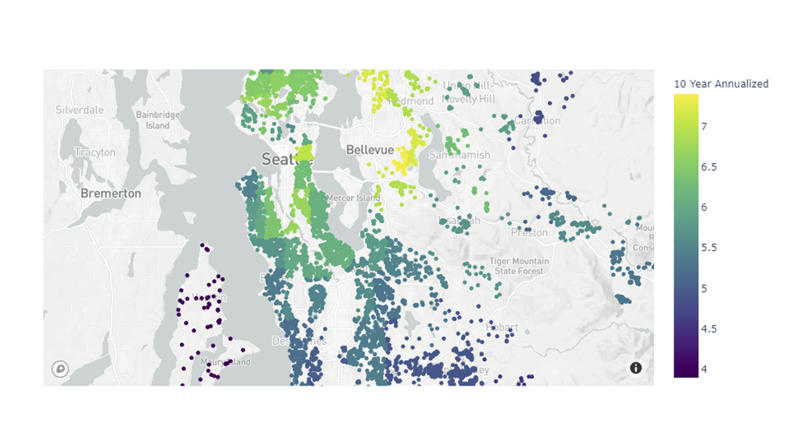
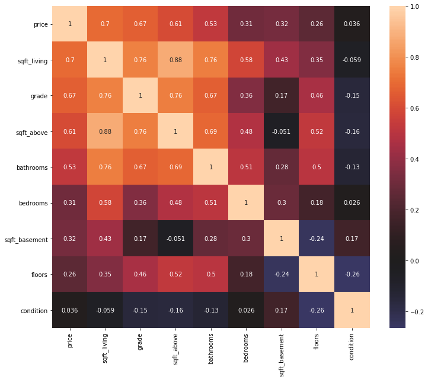

# King County Housing Data:
## Learning to Model & Predict



[Medium Blog Post](https://medium.com/p/b3b5b1cbda23/edit)

[Presentation PDF]()

[Video Walkthrough]()

## Purpose
King County Housing Prices have risen as the Seattle, WA area has become more popular. My partner and I were interested in the prospects of flipping houses in the area to make a profit, and buying with the intention of taking advantage of the market for renting. 
<!------------------------------------------>
### Data Description

<details><summary style="font-size: 18px"> 
List of Files:</summary> 

```
|-kc_house_data.csv
|-kc_neighborhood_import.csv
```
</details>
<!------------------------------------------>

### Main Questions:

[Question 1 Notebook Link](https://github.com/kailakay/dsc-mod-2-project-v2-1-onl01-dtsc-ft-041320/blob/master/Q1.ipynb)
<details><summary style="font-size: 24px">
Question 1: {What are the best ways to increase sales price for a home by 'flipping'?} </summary> 

```
In order to fully explore the popularity of genre, we wanted to answer two sub-questions:

- What features have a high correlation to sales price?
- Which features have the highest impact on increasing sales price?
```

#### Tables Used:

```
|kc_house_data.csv
```
#### EDA

Utilizing *The Movie Database* dataset, we were able to extract genre ID keys and pair them with genre names by utilizing an API key to pull in information from their website. *The Movie Database* has its own formula for calculating popularity that includes factors such as daily views and votes, the number of times a movie was favorited, and the release date - among others. 

We then used this quanititative popularity score per movie and extracted the respective genres. After grouping the data by genre, we then calculated the mean popularity of our correlated data set to create the table below. 



We filtered that data down to the top 9 genres, and compared them side by side in a boxen chart with a scattered bar chart. These two charts allowed us to visualize the data most comprehensively.

*On the left plot, the black lines show the median while the blue line shows the mean.*


Finally, we linked this data with our cleaned finance data, which allowed us to look directly at the finance information of the most popular genres.  


#### Conclusion

After cleaning and exploring the data, we found that **Action** was the most popular genre among consumers, followed by **Animation** and **Drama**. We also found that generally, popular genres were also lucrative financially - with a few outlying instances that showed higher rates of hit or miss such as Drama or the Thriller and Horror genres. 

#### Recommendation

While we do not recommend basing business decisions solely off of the popularity of a genre, the data indicates that we can generally assume popular genres are a safe investment. 

</details>

<!------------------------------------------>
[Question 2 Notebook Link](https://github.com/kailakay/dsc-mod-2-project-v2-1-onl01-dtsc-ft-041320/blob/master/Q2.ipynb)

<details><summary style="font-size: 24px">
Question 2:  {What are the best ways to improve housing grade and increase ROI when flipping houses?} </summary> 

```
In order to fully explore the aspects of crew on film success, we wanted to answer two sub-questions:

- Does staffing the production with more writers or directors influence profit?
- Is there an optimal writer/director ratio for maximizing profitability?
```

### Tables Used:

```
|Internet Movie Database - imdb.title.basics.csv.gz
|Box Office Mojo - bom.movie_gross.csv.gz
|The Internet Movie Database - tn.movie_budgets.csv.gz
```

### EDA

We started by cleaning our data and combining the relevant information into one table. We then broke down all of the information by genre, and calculated the ROI per movie based off of the financial information that we were provided. 


After charting the mean gross for each of the 19 genres that were in our database, we then graphed the top 7 grossing genres by mean - as seen below:


Next, we looked at the mean production budget by genre in order to investigate the correlation of the production budget to the gross. As you can see below, the 5 genres that had the highest production budget also showed up in the top 7 grossing genres. 


Finally, we calculated the mean ROI per genre and graphed the top 6 grossing genres by ROI using a violin plot, shown below.

The width of the plot indicates the proportion of instances that lie within that range, the black line shows the distribution of the interquartile range, while the white dot shows the median of the data. 


### Conclusion

We were interested to see that the **Science Fiction** genre was not relatively popular among consumers in our dataset, but that it showed as a positive financial prospect. I believe that in order to further interpret this data, we would need to broaded our datasets in regards to both finances and genre popularity.

However, we also noted that while **Action** was highly popular, it's likely that those high popularity ratings are inclinated towards high budget films. 

### Recommendation

While financial information does not showcase the entire picture in terms of success, our data shows that **Animation** has the most financial promise with an average ROI of 145%, while **Musicals** should be saved for niche audiences. 

</details>
<!------------------------------------------>

[Question 3 Notebook Link](https://github.com/kailakay/dsc-mod-2-project-v2-1-onl01-dtsc-ft-041320/blob/master/Q3.ipynb)

<details><summary style="font-size: 24px">
Question 3: {When are the best months to purchase a home?} </summary> 

```
In order to fully explore the financial aspects by genre, we wanted to answer three sub-questions:

- What are the mean production budgets and gross per genre?
- Does production budget impact overall gross?
- What is the Return of Investment(ROI) per genre?
```

### Tables Used:

```
|
|
```

### EDA


### Conclusion


### Recommendation


</details>
<!------------------------------------------>


# Wrap Up

We recommend that prospective buyers


The Action genre has a mean production budget of around 46.5 million dollars, with a mean gross of over 54 million dollars. A well developed film of this caliber will allow the studio to cover the costs of a second movie, perhaps in the Adventure or Animation genre, also due to their well-rounded attributes according to the data. 

We recommend that the debut Action film be limited to 1 director, with 2-3 writers.


# Future Work
- Create a larger dataset in order to gain more acurate insight
- Investigate larger dataset to find up and coming neighborhoods
- Look into pricing by school district and crime rate 
- Look into the cost to up a home by grade, and what the return would look like over time 

